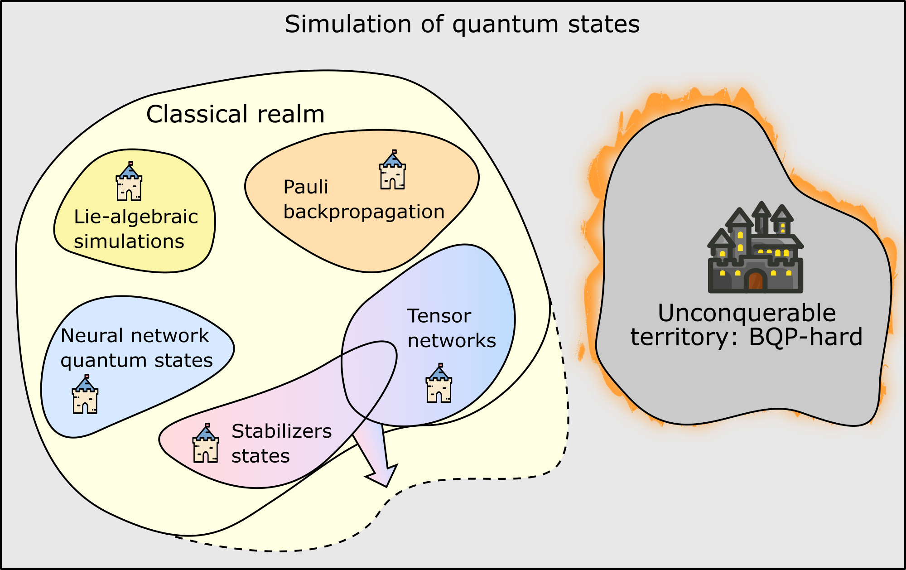

Theoretical Background, a snapshot
==================================

The fundamental challenge in quantum circuit simulation is the **exponential growth** of the Hilbert space: for a system of :math:`n` qubits, an exact representation requires :math:`2^n` complex amplitudes. Classical simulation techniques like statevector and density matrix methods face this exponential wall, making simulations with :math:`n > 50` impractical on current hardware.

Specialized simulators overcome this limitation by exploiting structure in quantum circuits. ``mpstab`` implements the **Hybrid Stabilizer-Matrix Product Operators (HSMPO)** method, which combines stabilizer simulation and tensor networks to enable efficient simulation of circuits with a mix of Clifford and non-Clifford operations.

As illustrated above, this hybrid approach decomposes the quantum state into a stabilizer backbone and a matrix product operator, allowing ``mpstab`` to simulate larger systems than either approach alone could handle.

Classical Simulation Approaches
-------------------------------

Before understanding the hybrid HSMPO method, it is useful to review the two key classical simulation strategies it combines:

**Stabilizer Simulation**

Stabilizer formalism is based on the concept of **stabilizer states**—special quantum states that can be efficiently described by a stabilizer group. A stabilizer state :math:`|\phi\rangle` satisfies :math:`S_i |\phi\rangle = |\phi\rangle` for a set of commuting Pauli operators :math:`S_i`. The key insight is that stabilizer states can be represented using only :math:`\mathcal{O}(n^2)` bits of classical information (via the stabilizer generators), rather than the exponential :math:`2^n` amplitudes required for a general quantum state. Moreover, applying Clifford gates (gates that preserve the Clifford group structure) is efficient and can be tracked in :math:`\mathcal{O}(n^2)` time using the **Gottesman-Knill theorem**. However, stabilizer simulation is limited to Clifford circuits—applying non-Clifford gates breaks the stabilizer formalism.

**Tensor Network Simulation**

Tensor networks provide a complementary approach based on exploiting **entanglement structure**. A quantum state can be represented as a tensor network—a contraction of many smaller tensors connected by indices. When the entanglement in a quantum state is structured (e.g., limited to chains or trees), the state admits a compact tensor network representation. A **Matrix Product State (MPS)** or **Matrix Product Operator (MPO)** is a tensor network tailored for one-dimensional systems where entanglement is localized. These representations scale as :math:`\mathcal{O}(n \cdot \chi^2)` in memory, where :math:`\chi` is the bond dimension. For weakly entangled states, :math:`\chi` remains small, making simulation tractable. Unlike stabilizer simulation, tensor networks can represent arbitrary quantum states, including those generated by non-Clifford gates, but they require managing and truncating the bond dimension adaptively.

**Hybrid Strengths**

The HSMPO method leverages the complementary strengths of these two approaches: it uses stabilizers to handle Clifford operations efficiently while reserving the tensor network capacity for representing the non-Clifford complexity. This hybrid strategy enables simulation of circuits that are "mostly Clifford" with non-trivial entanglement, a common scenario in practical quantum algorithms.

Other Hybrid Techniques
-----------------------

The HSMPO approach is part of a broader landscape of hybrid classical simulation methods that combine structured representations with tensor networks. A notable complementary approach is **Pauli propagation**, implemented in the `PauliPropagation.jl <https://github.com/MSRudolph/PauliPropagation.jl>`_ package. Pauli propagation tracks the evolution of Pauli strings through a quantum circuit by propagating Pauli operators using commutation relations, rather than storing the full quantum state. This approach is particularly efficient for computing expectation values of Pauli observables and excels in circuits dominated by Clifford operations, with minimal memory overhead.

Different hybrid methods make different trade-offs depending on the structure of the problem. HSMPO explicitly maintains both a stabilizer state and a tensor network representation, enabling simulation of circuits with moderate non-Clifford content through MPO truncation. Other approaches like Pauli propagation optimize for different circuit structures or measurement types. The choice of method depends on the specific characteristics of the circuits and observables being simulated.

The HSMPO Ansatz
----------------

In the HSMPO formalism, a quantum state :math:`|\Psi\rangle` of :math:`n` qubits is factorized into a product of two distinct mathematical objects:

.. math::
   |\Psi\rangle = \mathcal{W} | \phi \rangle

where:

* :math:`| \phi \rangle` is a **stabilizer state** (the "backbone"). It is defined by a stabilizer group :math:`\mathcal{S}` of :math:`n` independent Pauli operators :math:`\{S_1, \dots, S_n\}` such that :math:`S_i | \phi \rangle = | \phi \rangle` for all :math:`S_i \in \mathcal{S}`.
* :math:`\mathcal{W}` is a **Matrix Product Operator (MPO)**. This operator accounts for the "non-Cliffordness" of the state, mapping the stabilizer state into a more complex region of the Hilbert space that can represent universal quantum computation.

At initialization, the system is typically in the state :math:`|0\rangle^{\otimes n}`, which corresponds to setting :math:`\mathcal{W} = \mathbb{I}` and :math:`|\phi\rangle = |0\rangle^{\otimes n}`.

Evolution Rules
---------------

The core strength of ``mpstab`` lies in how it handles the evolution of this hybrid state under a unitary :math:`U`. The logic depends strictly on whether :math:`U` belongs to the **Clifford group** :math:`\mathcal{C}_n`:

1. **Clifford Evolution** (:math:`U \in \mathcal{C}_n`):
   If the gate is a Clifford gate (such as :math:`H`, :math:`S`, or :math:`CNOT`), it is absorbed directly into the stabilizer part:

   .. math::
      | \phi' \rangle = U | \phi \rangle, \quad \mathcal{W}' = \mathcal{W}

   This update is performed efficiently using the **Gottesman-Knill theorem**, modifying the stabilizer generators :math:`S_i \to U S_i U^\dagger`. This operation is extremely fast, with a computational complexity of :math:`\mathcal{O}(n^2)`.

2. **Non-Clifford Evolution** (:math:`U \notin \mathcal{C}_n`):
   If the gate is non-Clifford (such as a :math:`T` gate or a rotation :math:`R_y(\theta)`), it is "absorbed" into the MPO component:

   .. math::
      | \phi' \rangle = | \phi \rangle, \quad \mathcal{W}' = \mathcal{W} \cdot \tilde{U}

   where :math:`\tilde{U}` is the MPO representation of the gate. In the ``mpstab`` implementation (see ``mpstab.evolutors.hsmpo``), this involves an MPO-MPO contraction followed by a truncation step to maintain a manageable bond dimension :math:`\chi`.

Computational Complexity and Costs
----------------------------------

The motivation for this hybrid approach becomes clear when comparing its costs to other simulation strategies:

* **Statevector Simulation**:
   Requires storing :math:`2^n` complex coefficients. Applying a gate costs :math:`\mathcal{O}(2^n)` in both memory and time. This "exponential wall" makes simulations with :math:`n > 45` virtually impossible on current hardware.
* **Pure Stabilizer Simulation**:
   Requires only :math:`\mathcal{O}(n^2)` resources but is restricted to Clifford circuits, which cannot represent general quantum algorithms.
* **HSMPO (mpstab)**:
   The cost is primarily governed by the **bond dimension** :math:`\chi` of the MPO:
    - **Memory**: Scales as :math:`\mathcal{O}(n \cdot \chi^2)`.
    - **Execution**: Clifford gates scale as :math:`\mathcal{O}(n^2)`, while non-Clifford updates (including contraction and truncation) scale as :math:`\mathcal{O}(n \cdot \chi^3)`.

As long as the circuit's non-Clifford resources and entanglement allow for a compressed representation where :math:`\chi \ll 2^{n/2}`, ``mpstab`` can simulate systems significantly larger than those reachable by statevector simulators.

Numerical Truncation and Fidelity
---------------------------------

To maintain efficiency, ``mpstab`` utilizes **Singular Value Decomposition (SVD)** to truncate the bond dimension of :math:`\mathcal{W}` after non-Clifford operations. Given a set of singular values :math:`\sigma_j`, the truncation is performed such that:

.. math::
   \sum_{j=\chi+1}^{D} \sigma_j^2 < \epsilon

where :math:`\epsilon` is a precision parameter defined in the ``EvolutionConfig``. This introduces a controlled approximation error, allowing users to track the **fidelity lower bound** (see :doc:`fidelity_and_approximation`) and balance accuracy against computational time.
