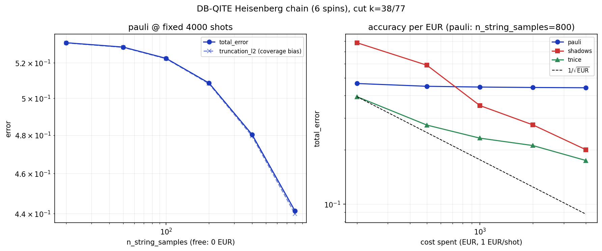

# Quantum Hardware: running a head/tail split on a device

This package answers one question: **given a circuit that `HSynthSMPO` has
split into a "head" and a "tail" at some cut point, how do we actually get an
expectation value out of real (or simulated) quantum hardware?**

## The problem in one picture

`HSynthSMPO` represents a circuit as a chain of "dressed" Pauli rotations. A
cut point `k` splits that chain in two:

```
|0...0>  --[ head: rotations 0..k ]--[ tail: rotations k..end ]-->  measure observable O
              ^                          ^
              |                          |
        runs on the device      folded into O classically,
                                 producing a new operator O' with
                                 the SAME expectation on the head state
```

So instead of running the *whole* circuit and measuring `O`, we run only the
*head* on the device and measure a *different* operator `O'` -- the
tail's rotations folded into `O` -- that gives the exact same number. Moving
the cut point trades head depth (cost on the device) against `O'`'s
complexity (cost of turning it into something measurable). This package is
the second half of that trade: **turning `O'` into circuits, shots, and
finally a number, however global or entangled `O'` turned out to be.**

## The pipeline, one module each

```
synthesis.py        head's rotations  ->  a runnable circuit
                                           (+ a small Clifford leftover)

pauli_expansion.py   O' (as an MPO)   ->  its Pauli-string decomposition
      or                                  (exact coefficients, or sampled)
tnice.py              (for "tnice")

plan.py              decomposition    ->  which circuits to run, how many
                                           shots each (fixed BEFORE anything
                                           runs, so it can be replayed on a
                                           simulator or on real hardware)

estimate.py           measured        ->  a value + its error bar
                       frequencies
```

`HSynthSMPO.expectation_at_cut` (in `mpstab.evolutors.hsynthsmpo`) is the one
function that runs all four steps and hands back the result. Everything
below explains what happens *inside* it.

## Three ways to turn O' into a number

All three share the *same* first step (resynthesising the head into a
circuit) and differ only in what they measure and how they turn the results
back into a number.

### `"pauli"` -- sample and group

`O'` is (approximately) a sum of Pauli strings with coefficients. This route
samples the largest ones from the tail's MPO, groups strings that can be
measured together in one basis choice ("qubit-wise commuting" grouping), and
runs one circuit per group. Cheap in circuits, and the error has a clean
theoretical bound -- but it needs `O'`'s Pauli decomposition to actually be
concentrated on a manageable number of strings.

### `"shadows"` -- classical shadows

Measures each qubit in a uniformly random Pauli basis (X, Y or Z), one shot
per random choice. Every such shot is *informationally complete*: the same
measured data can, in principle, be reused to estimate *any* observable.
The catch is the fixed recipe used to turn a shot into a number (the
"canonical dual" contraction) can have very large variance for observables
that spread across many qubits -- a well-known limitation of classical
shadows with *local* random measurements.

### `"tnice"` -- the same shadows data, smarter post-processing

Runs the *exact same* circuits and shots as `"shadows"` (same random bases,
same seed) -- nothing about what runs on the device changes. The only
difference is what happens after: instead of the fixed canonical-dual
recipe, it fits a second small tensor network (an MPS of "reconstruction
coefficients") to the measured data, chosen to minimize the statistical
variance while still reproducing `O'` on average. This is the
Mangini & Cavalcanti TN-ICE method (arXiv:2407.02923) -- see
`tnice.py`'s module docstring for the equations. Because it reuses
`"shadows"`'s measurement data unchanged, it's directly comparable: same
"quantum" cost (shots and circuits), usually a smaller error bar, at the
price of some extra *classical* compute to do the fit.

## The two currencies

Every route spends two different things, and they don't trade off the same
way:

- **Quantum**: circuits executed on the device and shots spent. This is
  fixed once a route and a shot budget are chosen (`"pauli"` typically needs
  far fewer distinct circuits than `"shadows"`/`"tnice"`, which need one
  random basis per shot by construction).
- **Classical**: the post-processing cost of `estimate()`. Trivial for
  `"pauli"`/`"shadows"` (a fixed contraction); for `"tnice"` it scales with
  how entangled `O'` is (its MPO bond dimension) -- expensive exactly when
  the tail is long and `"shadows"`'s variance problem is worst, cheap when
  the tail is short and there was nothing to gain in the first place.

`examples/hsynthsmpo_cut_sweep_comparison.py` and
`examples/hsynthsmpo_qite_cut_sweep.py` measure both directly (circuits
executed and `estimate()` wall-clock time) alongside the usual
value/error-bar comparison.

## How much does accuracy actually cost?

The numbers below are from `examples/hsynthsmpo_qite_cost_analysis.py`, on a
circuit that has nothing to do with quantum hardware design: a few steps of
Double-Bracket Quantum Imaginary-Time Evolution (`qrisp.algorithms.qite`,
arXiv:2412.04554) approximating the ground state of a 6-site Heisenberg
chain (8 physical qubits once `qrisp`'s own ancilla qubits are counted, 77
magic gates after `HSynthSMPO`'s Clifford/magic split -- see
`examples/hsynthsmpo_qite_cut_sweep.py`'s module docstring for how a `qrisp`
circuit gets translated into something `HSynthSMPO` can use at all). One
fixed cut, one fixed observable (a spin-spin correlator), pricing every shot
at 1 EUR:

### `"pauli"`'s other knob is free

`n_string_samples` (how many Pauli strings the sampler keeps from `O'`'s
decomposition) is chosen *before* any shot is spent -- raising it costs
exactly 0 EUR, only classical compute:



*(left panel)* At a fixed 4000-shot budget, `total_error` barely moves from
`n_string_samples=20` to `800` (0.53 -> 0.44) -- it's dominated almost
entirely by `truncation_l2`, the systematic bias from Pauli strings the
sampler never even considered, not by shot noise. No amount of *shots* fixes
that; only more *string samples* does, and on a circuit this entangled even
800 isn't close to enough (65 measurement settings and still falling).
**Moral: if `"pauli"`'s error stops improving as you add shots, check
`result.truncation_l2` before reaching for a bigger shot budget -- it's
usually the wrong knob.**

### EUR spent vs accuracy, all three routes

*(right panel, same figure)* Fixing `"pauli"` at `n_string_samples=800` and
sweeping the shot budget for all three routes:

| EUR spent | pauli | shadows | tnice |
|---:|---:|---:|---:|
| 200  | 0.466 | 0.784 | **0.394** |
| 500  | 0.450 | 0.588 | **0.274** |
| 1000 | 0.445 | 0.352 | **0.232** |
| 2000 | 0.443 | 0.275 | **0.211** |
| 4000 | 0.441 | 0.200 | **0.175** |

(`total_error`, lower is better.) `"tnice"` is cheapest at every budget
measured here, and its curve tracks closest to the `1/sqrt(EUR)` reference a
statistically well-behaved estimator should follow; `"pauli"` is flat for
the reason above (it needs more `n_string_samples`, not more EUR); `"shadows"`
improves steadily but stays the most expensive of the three in this range.

**Extrapolating beyond the measured range is where this breaks down --
worth saying explicitly rather than glossing over.** Fitting a power law to
these five points and solving for "EUR needed to reach `total_error=0.07`"
gives `"shadows"` ~36,000 EUR, `"tnice"` ~126,000 EUR, and `"pauli"` a
physically meaningless multi-digit-exponent number, because `"pauli"`'s curve
isn't a power law at all here -- it's a plateau (see above), and a power-law
fit through five nearly-flat points extrapolates nonsense the moment you ask
it to reach below that plateau. The lesson isn't "shadows beats tnice
asymptotically"; it's **don't trust a cost extrapolation past the shot range
you actually measured**, especially for a route that's visibly not
shot-noise-limited yet.

## Where to look next

- `mpstab.evolutors.hsynthsmpo.HSynthSMPO.expectation_at_cut` -- the entry
  point; its docstring lists every argument each route accepts.
- `tests/test_expectation_methods.py`, `tests/test_pauli_sampling.py`,
  `tests/test_tnice.py` -- one route/module per test file, each checked
  against the exact (uncut) reference.
- `examples/hsynthsmpo_*.py` -- runnable comparisons with plots: a
  shot-budget convergence sweep (`hsynthsmpo_shot_convergence.py`), the
  EUR-per-shot cost analysis this README's numbers come from
  (`hsynthsmpo_cost_analysis.py` on a generic ansatz,
  `hsynthsmpo_qite_cost_analysis.py` on the `qrisp` DB-QITE circuit), and a
  physically-motivated circuit from `qrisp` on its own
  (`hsynthsmpo_qite_cut_sweep.py`).
